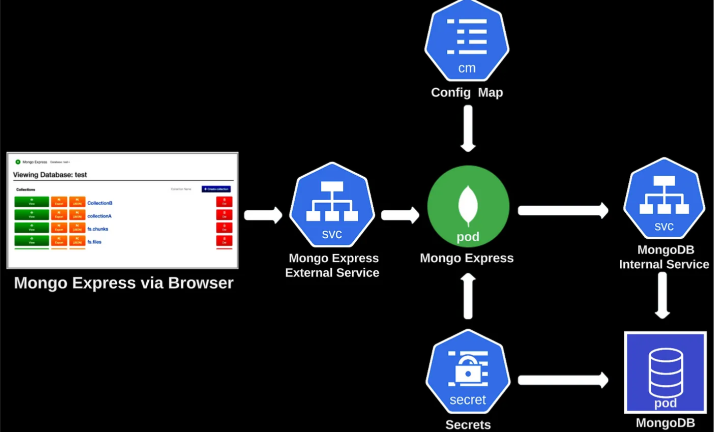
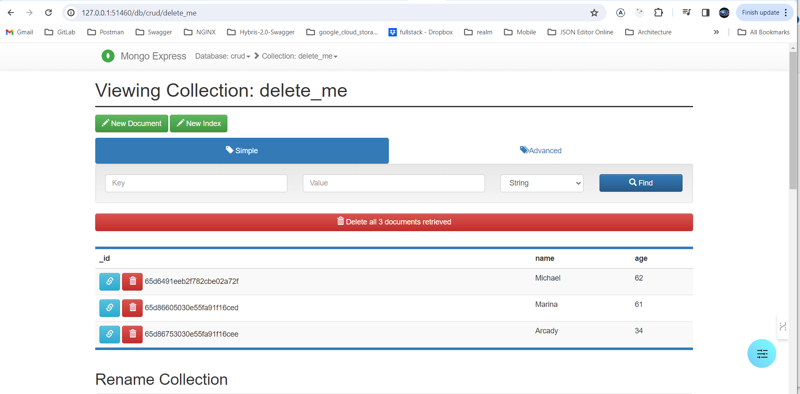

# MongoKube

*  MongoKube is a project that deploys Mongo Express (a web-based MongoDB admin interface) and Mongo Server (the backend server) on Kubernetes.




## Features

* **Mongo Express**: A web-based MongoDB admin interface, written with Node.js and express.
* **Mongo Server**: The backend server for the MongoDB database.

## Prerequisites

* Kubernetes
     Local Setup
     ===========
     Minikube is an open-source tool that allows you to create a local Kubernetes environment on any Linux, Mac, or Windows system. It gives you the capability to test and experiment with Kubernetes deployments locally. It runs on your machine using some form of a hypervisor. Minikube will create a virtual machine on your laptop and the node will run inside that virtual box. By default, it creates a one-node cluster, but you can create a multi-node cluster with a Minikube environment if desired. I’m on Windows 10; other operating systems may have different commands and steps. At the end of the article, I have provided links to the documentation where you can find the steps for your OS.


## Installation.
** Minikube has kubectl as a dependency, so the above command will also install kubectl.

To install Minikube on Windows 10, you can follow these steps:

1. **Install Chocolatey**: Chocolatey is a package manager for Windows. Open PowerShell as an administrator and run the following command:

```powershell
Set-ExecutionPolicy Bypass -Scope Process -Force; [System.Net.ServicePointManager]::SecurityProtocol = [System.Net.ServicePointManager]::SecurityProtocol -bor 3072; iex ((New-Object System.Net.WebClient).DownloadString('https://chocolatey.org/install.ps1'))
```

2. **Install kubectl**: kubectl is a command line tool for controlling Kubernetes clusters. Install it by running the following command in PowerShell:

```powershell
choco install kubernetes-cli
```

3. **Install Minikube**: Now you can install Minikube itself. Run the following command in PowerShell:

```powershell
choco install minikube
```

4. **Start Minikube**: You can start Minikube with the following command:

```powershell
minikube start
```

5. **Check the installation**: To confirm that everything is set up correctly, you can run the following command:

```powershell
kubectl get pods --all-namespaces
```

This should show you a list of all pods in your cluster. If you see a list of pods without any errors, then everything is set up correctly.

Remember, you need to have Virtualization enabled in your BIOS and you need to have a version of Windows 10 that supports Hyper-V. If you don't, you may need to use a different VM driver like VirtualBox.

## Commands.

### kubectl commands
`kubectl get nodes`

`kubectl get pod`

`kubectl get services`

`kubectl create deployment nginx-depl --image=nginx`

`kubectl get deployment`

`kubectl get replicaset`

### debugging
`kubectl logs {pod-name}`

`kubectl exec -it {pod-name} -- bin/bash`

### create mongo deployment
`kubectl create deployment mongo-depl --image=mongo`

`kubectl logs mongo-depl-{pod-name}`

`kubectl describe pod mongo-depl-{pod-name}`

### delete deplyoment
`kubectl delete deployment mongo-depl`

`kubectl delete deployment nginx-depl`

### create or edit config file
`vim nginx-deployment.yaml`

`kubectl apply -f nginx-deployment.yaml`

`kubectl get pod`

`kubectl get deployment`

### delete with config
`kubectl delete -f nginx-deployment.yaml`

#Metrics

`kubectl top` The kubectl top command returns current CPU and memory usage for a cluster’s pods or nodes, or for a particular pod or node if specified.

## Future Updates.

- [ ] Add a JSON website that will pull and push data into your database,
Then add collection user contains the following records:
```bash
{"_id":{"$oid":"65d6491eeb2f782cbe02a72f"},"name":"Michael","age":62}
{"_id":{"$oid":"65d86605030e55fa91f16ced"},"name":"Marina","age":61}
{"_id":{"$oid":"65d86753030e55fa91f16cee"},"name":"Arcady","age":34}
```




Explain how to use your project, any endpoints, services, and how to interact with them.

## Complete My KubeSessionLogs.
```bash
PS D:\k8s> kubectl apply -f mongo-secret.yaml
secret/mongodb-secret unchanged
PS D:\k8s> kubectl get service
NAME         TYPE        CLUSTER-IP   EXTERNAL-IP   PORT(S)   AGE
kubernetes   ClusterIP   10.96.0.1    <none>        443/TCP   40h
PS D:\k8s> kubectl get service
NAME         TYPE        CLUSTER-IP   EXTERNAL-IP   PORT(S)   AGE
kubernetes   ClusterIP   10.96.0.1    <none>        443/TCP   40h
PS D:\k8s> kubectl apply -f mongodb-depl.yaml
deployment.apps/mongodb-deployment created
service/mongodb-service created
PS D:\k8s> kubectl get service
NAME              TYPE        CLUSTER-IP     EXTERNAL-IP   PORT(S)     AGE
mongodb-service   ClusterIP   10.107.36.37   <none>        27017/TCP   7s
PS D:\k8s>
mongodb-service   ClusterIP   10.107.36.37   <none>        27017/TCP   116s
Name:              mongodb-service
Labels:            <none>
Annotations:       <none>
Type:              ClusterIP
Session Affinity:  None
Events:            <none>
PS D:\k8s> kubectl get pod -o wide
mongodb-deployment-699744c7d-4lqkj   1/1     Running   0          2m29s   10.244.0.97   minikube   <none>           <none>
PS D:\k8s>
PS D:\k8s>
PS D:\k8s>
PS D:\k8s>
PS D:\k8s>
PS D:\k8s> kubectl apply -f mongo-configmap.yaml
configmap/mongodb-configmap configured
PS D:\k8s> kubectl apply -f mongo-express.yaml
error: the path "mongo-express.yaml" does not exist


PS D:\k8s> kubectl apply -f mongoexpress-depl.yaml
deployment.apps/mongo-express created
PS D:\k8s>
PS D:\k8s>
PS D:\k8s>
PS D:\k8s>
NAME              TYPE        CLUSTER-IP     EXTERNAL-IP   PORT(S)     AGE
kubernetes        ClusterIP   10.96.0.1      <none>        443/TCP     40h
mongodb-service   ClusterIP   10.107.36.37   <none>        27017/TCP   5m29s
Name:              mongodb-service
Namespace:         default
Labels:            <none>
Annotations:       <none>
Selector:          app=mongodb
Type:              ClusterIP
IP Family Policy:  SingleStack
IP Families:       IPv4
IP:                10.107.36.37
IPs:               10.107.36.37
Port:              <unset>  27017/TCP
TargetPort:        27017/TCP
Endpoints:         10.244.0.97:27017
Session Affinity:  None
Events:            <none>
PS D:\k8s> kubectl get pod -o wide
NAME              TYPE        CLUSTER-IP     EXTERNAL-IP   PORT(S)     AGE
kubernetes        ClusterIP   10.96.0.1      <none>        443/TCP     40h
mongodb-service   ClusterIP   10.107.36.37   <none>        27017/TCP   8m26s
PS D:\k8s> kubectl describe service mongodb-service
Name:              mongodb-service
Labels:            <none>
Selector:          app=mongodb
Type:              ClusterIP
IP Family Policy:  SingleStack
IP Families:       IPv4
IPs:               10.107.36.37
PS D:\k8s>

PS D:\k8s>
PS D:\k8s>
PS D:\k8s>
PS D:\k8s>
PS D:\k8s> kubectl describe service mongo-express-service
Name:                     mongo-express-service
Namespace:                default
Labels:                   <none>
Annotations:              <none>
Selector:                 app=mongo-express
Type:                     LoadBalancer
IP Family Policy:         SingleStack
IP Families:              IPv4
IP:                       10.102.136.167
IPs:                      10.102.136.167
Port:                     <unset>  8081/TCP
TargetPort:               8081/TCP
NodePort:                 <unset>  30000/TCP
Endpoints:                10.244.0.98:8081
Session Affinity:         None
External Traffic Policy:  Cluster
Events:                   <none>
PS D:\k8s>
PS D:\k8s>
PS D:\k8s>
PS D:\k8s>
PS D:\k8s> minikube service mongo-express-service
|-----------|-----------------------|-------------|---------------------------|
| NAMESPACE |         NAME          | TARGET PORT |            URL            |
|-----------|-----------------------|-------------|---------------------------|
| default   | mongo-express-service |        8081 | http://192.168.49.2:30000 |
|-----------|-----------------------|-------------|---------------------------|
🏃  Starting tunnel for service mongo-express-service.
|-----------|-----------------------|-------------|------------------------|
| NAMESPACE |         NAME          | TARGET PORT |          URL           |
|-----------|-----------------------|-------------|------------------------|
| default   | mongo-express-service |             | http://127.0.0.1:64408 |
|-----------|-----------------------|-------------|------------------------|
🎉  Opening service default/mongo-express-service in default browser...
❗  Because you are using a Docker driver on windows, the terminal needs to be open to run it.
```

##

Чтобы получить доступ к `mongo-express-service` с внешнего компьютера, вы обычно предоставляете его через общедоступный IP-адрес,
используя тип службы LoadBalancer в Kubernetes. Однако Minikube — это локальная среда Kubernetes, предназначенная для разработки
и тестирования, и она не поддерживает тип службы LoadBalancer «из коробки».

Если вы используете свой кластер Kubernetes в облачной среде, такой как AWS, Google Cloud или Azure, вы можете использовать тип службы LoadBalancer, и поставщик облака автоматически предоставит общедоступный IP-адрес для вашей службы.

Если вы хотите получить доступ к сервисам Minikube с внешнего компьютера, у вас есть несколько вариантов:

1. **Переадресация портов**. Если внешний компьютер находится в той же сети, что и ваш хост-компьютер Minikube, вы можете настроить
переадресацию портов на маршрутизаторе для перенаправления трафика с определенного порта в службу Minikube.

2. **ngrok или аналогичные службы**. Вы можете использовать такие службы, как ngrok, которые могут предоставлять доступ к общедоступному
 Интернету через защищенные туннели локальным серверам за NAT и брандмауэрами.

3. **VPN**: настройте VPN так, чтобы внешний компьютер находился в той же сети, что и ваш хост-компьютер Minikube.
Помните, что предоставление доступа к вашим сервисам в общедоступном Интернете может иметь последствия для безопасности.
Всегда проверяйте, что ваши службы защищены, например, с помощью аутентификации и шифрования (HTTPS).


##
```bash

			Log of mongo-express-859f75dd4f-xbc7h

PS D:\k8s> kubectl logs mongo-express-859f75dd4f-xbc7h
Waiting for mongo:27017...
/docker-entrypoint.sh: line 15: mongo: Try again
/docker-entrypoint.sh: line 15: /dev/tcp/mongo/27017: Invalid argument
Fri Feb 23 08:43:10 UTC 2024 retrying to connect to mongo:27017 (2/10)
/docker-entrypoint.sh: line 15: mongo: Try again
/docker-entrypoint.sh: line 15: /dev/tcp/mongo/27017: Invalid argument
Fri Feb 23 08:43:16 UTC 2024 retrying to connect to mongo:27017 (3/10)
/docker-entrypoint.sh: line 15: mongo: Try again
/docker-entrypoint.sh: line 15: /dev/tcp/mongo/27017: Invalid argument
Fri Feb 23 08:43:22 UTC 2024 retrying to connect to mongo:27017 (4/10)
/docker-entrypoint.sh: line 15: mongo: Try again
/docker-entrypoint.sh: line 15: /dev/tcp/mongo/27017: Invalid argument
Fri Feb 23 08:43:28 UTC 2024 retrying to connect to mongo:27017 (5/10)
/docker-entrypoint.sh: line 15: mongo: Try again
/docker-entrypoint.sh: line 15: /dev/tcp/mongo/27017: Invalid argument
Fri Feb 23 08:43:34 UTC 2024 retrying to connect to mongo:27017 (6/10)
/docker-entrypoint.sh: line 15: mongo: Try again
/docker-entrypoint.sh: line 15: /dev/tcp/mongo/27017: Invalid argument
Fri Feb 23 08:43:40 UTC 2024 retrying to connect to mongo:27017 (7/10)
/docker-entrypoint.sh: line 15: mongo: Try again
/docker-entrypoint.sh: line 15: /dev/tcp/mongo/27017: Invalid argument
Fri Feb 23 08:43:46 UTC 2024 retrying to connect to mongo:27017 (8/10)
/docker-entrypoint.sh: line 15: mongo: Try again
/docker-entrypoint.sh: line 15: /dev/tcp/mongo/27017: Invalid argument
Fri Feb 23 08:43:52 UTC 2024 retrying to connect to mongo:27017 (9/10)
/docker-entrypoint.sh: line 15: mongo: Try again
/docker-entrypoint.sh: line 15: /dev/tcp/mongo/27017: Invalid argument
Fri Feb 23 08:43:58 UTC 2024 retrying to connect to mongo:27017 (10/10)
/docker-entrypoint.sh: line 15: mongo: Try again
/docker-entrypoint.sh: line 15: /dev/tcp/mongo/27017: Invalid argument
No custom config.js found, loading config.default.js
Welcome to mongo-express 1.0.2
------------------------


Mongo Express server listening at http://0.0.0.0:8081
Server is open to allow connections from anyone (0.0.0.0)
basicAuth credentials are "admin:pass", it is recommended you change this in your config.js!
GET / 200 85.621 ms - 9283
GET /public/css/bootstrap.min.css 200 15.673 ms - 121457
GET /public/css/bootstrap-theme.min.css 200 15.629 ms - 23411
GET /public/css/style.css 200 13.691 ms - 1883
GET /public/img/mongo-express-logo.png 200 13.347 ms - 17847
GET /public/vendor-93f5fc3ae20e0dfd68cb.min.js 200 14.775 ms - 131153
GET /public/index-56afe067afbbbde795be.min.js 200 4.303 ms - 936
GET /public/img/gears.gif 200 5.565 ms - 50281
GET /public/fonts/glyphicons-halflings-regular.woff2 200 4.639 ms - 18028
POST / 302 74.015 ms - 46
GET / 200 28.817 ms - 9999
GET /public/css/bootstrap.min.css 304 10.835 ms - -
GET /public/css/bootstrap-theme.min.css 304 9.093 ms - -
GET /public/css/style.css 304 6.338 ms - -
GET /public/img/mongo-express-logo.png 304 5.939 ms - -
GET /public/vendor-93f5fc3ae20e0dfd68cb.min.js 304 4.650 ms - -
GET /public/index-56afe067afbbbde795be.min.js 304 1.498 ms - -
GET /public/img/gears.gif 304 1.023 ms - -
GET /public/fonts/glyphicons-halflings-regular.woff2 304 1.510 ms - -
GET /db/crud/ 200 23.265 ms - 8490
GET /public/css/bootstrap.min.css 304 4.330 ms - -
GET /public/css/bootstrap-theme.min.css 304 4.009 ms - -
GET /public/css/style.css 304 4.377 ms - -
GET /public/vendor-93f5fc3ae20e0dfd68cb.min.js 304 5.032 ms - -
GET /public/img/mongo-express-logo.png 304 7.561 ms - -
GET /public/img/gears.gif 304 1.369 ms - -
GET /public/database-5a651a66c59f5316bdde.min.js 200 5.412 ms - 1447
POST /db/crud/ 302 47.752 ms - 70
GET /db/crud/user 200 48.502 ms - 17070
GET /public/css/bootstrap.min.css 304 0.700 ms - -
GET /public/css/codemirror.css 200 7.454 ms - 8722
GET /public/css/bootstrap-theme.min.css 304 3.545 ms - -
GET /public/css/style.css 304 2.243 ms - -
GET /public/img/mongo-express-logo.png 304 2.057 ms - -
GET /public/css/theme/rubyblue.css 200 12.126 ms - 1801
GET /public/vendor-93f5fc3ae20e0dfd68cb.min.js 304 2.143 ms - -
GET /public/img/gears.gif 304 0.958 ms - -
GET /public/collection-70f10ba9e63af80d0f15.min.js 200 6.091 ms - 94647
GET /public/codemirror-c3ecf01fea09ef4fd0c5.min.js 200 5.907 ms - 188516
POST /checkValid 200 16.042 ms - 5
POST /db/crud/user 302 25.398 ms - 70
GET /db/crud/user 200 49.224 ms - 20003
GET /public/css/bootstrap.min.css 304 9.416 ms - -
GET /public/css/bootstrap-theme.min.css 304 10.148 ms - -
GET /public/css/style.css 304 6.588 ms - -
GET /public/css/codemirror.css 304 5.459 ms - -
GET /public/css/theme/rubyblue.css 304 4.896 ms - -
GET /public/img/mongo-express-logo.png 304 4.220 ms - -
GET /public/vendor-93f5fc3ae20e0dfd68cb.min.js 304 0.499 ms - -
GET /public/codemirror-c3ecf01fea09ef4fd0c5.min.js 304 0.629 ms - -
GET /public/collection-70f10ba9e63af80d0f15.min.js 304 1.885 ms - -
GET /public/img/gears.gif 304 2.086 ms - -
SyntaxError: Unexpected token (3:8)
    at pp$4.raise (/app/node_modules/acorn/dist/acorn.js:3459:15)
    at pp$9.unexpected (/app/node_modules/acorn/dist/acorn.js:760:10)
    at pp$9.expect (/app/node_modules/acorn/dist/acorn.js:754:28)
    at pp$5.parseObj (/app/node_modules/acorn/dist/acorn.js:3080:14)
    at pp$5.parseExprAtom (/app/node_modules/acorn/dist/acorn.js:2819:19)
    at pp$5.parseExprSubscripts (/app/node_modules/acorn/dist/acorn.js:2635:21)
    at pp$5.parseMaybeUnary (/app/node_modules/acorn/dist/acorn.js:2601:19)
    at pp$5.parseExprOps (/app/node_modules/acorn/dist/acorn.js:2528:21)
    at pp$5.parseMaybeConditional (/app/node_modules/acorn/dist/acorn.js:2511:21)
    at pp$5.parseMaybeAssign (/app/node_modules/acorn/dist/acorn.js:2478:21) {
  pos: 37,
  loc: Position { line: 3, column: 8 },
  raisedAt: 43
}
POST /checkValid 200 13.332 ms - 7
POST /checkValid 200 12.206 ms - 5
POST /db/crud/user 302 22.919 ms - 70
GET /db/crud/user 200 43.252 ms - 21278
GET /public/css/bootstrap.min.css 304 6.913 ms - -
GET /public/css/bootstrap-theme.min.css 304 6.214 ms - -
GET /public/css/style.css 304 6.149 ms - -
GET /public/css/codemirror.css 304 3.606 ms - -
GET /public/css/theme/rubyblue.css 304 3.539 ms - -
GET /public/img/mongo-express-logo.png 304 3.527 ms - -
GET /public/vendor-93f5fc3ae20e0dfd68cb.min.js 304 0.805 ms - -
GET /public/codemirror-c3ecf01fea09ef4fd0c5.min.js 304 0.950 ms - -
GET /public/img/gears.gif 304 2.449 ms - -
GET /public/collection-70f10ba9e63af80d0f15.min.js 304 2.067 ms - -
GET /db/crud/user/%2265d6491eeb2f782cbe02a72f%22?skip=0 200 35.044 ms - 5790
GET /public/css/bootstrap.min.css 304 2.917 ms - -
GET /public/css/bootstrap-theme.min.css 304 2.059 ms - -
GET /public/css/style.css 304 4.807 ms - -
GET /public/css/codemirror.css 304 4.070 ms - -
GET /public/css/theme/rubyblue.css 304 3.833 ms - -
GET /public/img/mongo-express-logo.png 304 3.297 ms - -
GET /public/vendor-93f5fc3ae20e0dfd68cb.min.js 304 2.257 ms - -
GET /public/codemirror-c3ecf01fea09ef4fd0c5.min.js 304 2.219 ms - -
GET /public/img/gears.gif 304 0.718 ms - -
GET /public/document-8510238b468385d4b46d.min.js 200 4.243 ms - 1547
GET /db/crud/user/%2265d86605030e55fa91f16ced%22?skip=0 200 28.844 ms - 5790
GET /public/css/bootstrap.min.css 304 2.871 ms - -
GET /public/css/bootstrap-theme.min.css 304 4.130 ms - -
GET /public/css/style.css 304 5.009 ms - -
GET /public/css/codemirror.css 304 4.712 ms - -
GET /public/css/theme/rubyblue.css 304 4.077 ms - -
GET /public/img/mongo-express-logo.png 304 3.688 ms - -
GET /public/vendor-93f5fc3ae20e0dfd68cb.min.js 304 2.056 ms - -
GET /public/codemirror-c3ecf01fea09ef4fd0c5.min.js 304 1.497 ms - -
GET /public/document-8510238b468385d4b46d.min.js 304 0.694 ms - -
GET /public/img/gears.gif 304 0.794 ms - -
GET /db/crud/user/%2265d86605030e55fa91f16ced%22?skip=0 304 52.737 ms - -
GET /public/css/bootstrap.min.css 304 1.509 ms - -
GET /public/css/bootstrap-theme.min.css 304 1.344 ms - -
GET /public/css/style.css 304 3.894 ms - -
GET /public/css/codemirror.css 304 3.493 ms - -
GET /public/css/theme/rubyblue.css 304 10.515 ms - -
GET /public/vendor-93f5fc3ae20e0dfd68cb.min.js 304 7.565 ms - -
GET /public/img/mongo-express-logo.png 304 6.362 ms - -
GET /public/codemirror-c3ecf01fea09ef4fd0c5.min.js 304 5.053 ms - -
GET /public/document-8510238b468385d4b46d.min.js 304 2.331 ms - -
GET /public/img/gears.gif 304 2.077 ms - -
POST /checkValid 200 8.972 ms - 5
PUT /db/crud/user/%2265d86605030e55fa91f16ced%22?skip=0 302 17.985 ms - 84
GET /db/crud/user?skip=0 200 57.337 ms - 21279
GET /public/css/bootstrap.min.css 304 2.783 ms - -
GET /public/css/bootstrap-theme.min.css 304 2.020 ms - -
GET /public/css/style.css 304 5.962 ms - -
GET /public/css/codemirror.css 304 5.384 ms - -
GET /public/css/theme/rubyblue.css 304 3.055 ms - -
GET /public/img/mongo-express-logo.png 304 1.766 ms - -
GET /public/vendor-93f5fc3ae20e0dfd68cb.min.js 304 1.775 ms - -
GET /public/codemirror-c3ecf01fea09ef4fd0c5.min.js 304 1.694 ms - -
GET /public/collection-70f10ba9e63af80d0f15.min.js 304 1.515 ms - -
GET /public/img/gears.gif 304 0.784 ms - -
GET /db/crud/expCsv/user?key=&value=&type=&query=&projection= 200 12.842 ms - -
GET /db/crud/expArr/user?key=&value=&type=&query=&projection= 200 97.981 ms - -
GET /db/crud/export/user?key=&value=&type=&query=&projection= 200 31.911 ms - -
DELETE /db/crud/user?key=&value=&type=&query={}&projection=&runAggregate=false 302 36.966 ms - 70
GET /db/crud/user 200 110.886 ms - 17095
GET /public/css/bootstrap.min.css 304 6.699 ms - -
GET /public/css/bootstrap-theme.min.css 304 12.000 ms - -
GET /public/css/style.css 304 10.227 ms - -
GET /public/css/codemirror.css 304 10.138 ms - -
GET /public/css/theme/rubyblue.css 304 10.608 ms - -
GET /public/img/mongo-express-logo.png 304 12.364 ms - -
GET /public/vendor-93f5fc3ae20e0dfd68cb.min.js 304 5.056 ms - -
GET /public/codemirror-c3ecf01fea09ef4fd0c5.min.js 304 17.730 ms - -
GET /public/collection-70f10ba9e63af80d0f15.min.js 304 2.330 ms - -
GET /public/img/gears.gif 304 68.577 ms - -
TypeError: Found non-callable @@iterator
    at exp.importCollection (file:///app/lib/routes/collection.js:512:16)
    at Layer.handle [as handle_request] (/app/node_modules/express/lib/router/layer.js:95:5)
    at next (/app/node_modules/express/lib/router/route.js:144:13)
    at mongoMiddleware (file:///app/lib/router.js:263:5)
    at Layer.handle [as handle_request] (/app/node_modules/express/lib/router/layer.js:95:5)
    at next (/app/node_modules/express/lib/router/route.js:144:13)
    at Route.dispatch (/app/node_modules/express/lib/router/route.js:114:3)
    at Layer.handle [as handle_request] (/app/node_modules/express/lib/router/layer.js:95:5)
    at /app/node_modules/express/lib/router/index.js:284:15
    at param (/app/node_modules/express/lib/router/index.js:365:14)
POST /db/crud/import/user 400 39.286 ms - 16
POST /db/crud/import/user 200 74.280 ms - 22
POST /checkValid 200 10.273 ms - 5
POST /db/crud/user 302 21.872 ms - 70
GET /db/crud/user 200 55.212 ms - 22549
GET /public/css/bootstrap.min.css 304 5.489 ms - -
GET /public/css/bootstrap-theme.min.css 304 2.501 ms - -
GET /public/css/style.css 304 6.213 ms - -
GET /public/css/codemirror.css 304 7.744 ms - -
GET /public/css/theme/rubyblue.css 304 9.589 ms - -
GET /public/img/mongo-express-logo.png 304 9.189 ms - -
GET /public/vendor-93f5fc3ae20e0dfd68cb.min.js 304 8.076 ms - -
GET /public/codemirror-c3ecf01fea09ef4fd0c5.min.js 304 0.628 ms - -
GET /public/collection-70f10ba9e63af80d0f15.min.js 304 0.811 ms - -
GET /public/img/gears.gif 304 1.540 ms - -
GET /db/crud/expArr/user?key=&value=&type=&query=&projection= 200 17.735 ms - -
GET /db/crud/export/user?key=&value=&type=&query=&projection= 200 25.815 ms - -
GET /db/crud/user?query=%7B%0D%0A++++%22age%22%3A+%7B+%22%24gt%22%3A+60+%7D%0D%0A%7D&projection= 200 82.870 ms - 21540
GET /public/css/bootstrap.min.css 304 1.542 ms - -
GET /public/css/bootstrap-theme.min.css 304 2.411 ms - -
GET /public/css/style.css 304 3.856 ms - -
GET /public/css/codemirror.css 304 15.281 ms - -
GET /public/vendor-93f5fc3ae20e0dfd68cb.min.js 304 16.943 ms - -
GET /public/css/theme/rubyblue.css 304 16.221 ms - -
GET /public/img/mongo-express-logo.png 304 11.002 ms - -
GET /public/codemirror-c3ecf01fea09ef4fd0c5.min.js 304 6.338 ms - -
GET /public/collection-70f10ba9e63af80d0f15.min.js 304 5.694 ms - -
GET /public/img/gears.gif 304 14.820 ms - -
GET /db/crud/user?query=%7B%0D%0A++++%22name%22%3A+1%0D%0A%7D&projection= 200 58.209 ms - 17078
GET /public/css/bootstrap.min.css 304 3.370 ms - -
GET /public/css/bootstrap-theme.min.css 304 2.399 ms - -
GET /public/css/style.css 304 1.991 ms - -
GET /public/css/codemirror.css 304 2.807 ms - -
GET /public/css/theme/rubyblue.css 304 2.778 ms - -
GET /public/img/mongo-express-logo.png 304 3.127 ms - -
GET /public/vendor-93f5fc3ae20e0dfd68cb.min.js 304 0.748 ms - -
GET /public/codemirror-c3ecf01fea09ef4fd0c5.min.js 304 2.058 ms - -
GET /public/collection-70f10ba9e63af80d0f15.min.js 304 1.487 ms - -
GET /public/img/gears.gif 304 1.226 ms - -
GET /db/crud/user?query=%7B%0D%0A++++%22name%22%3A+%22Michael%22%0D%0A%7D&projection= 200 66.920 ms - 20159
GET /public/css/bootstrap.min.css 304 0.978 ms - -
GET /public/css/bootstrap-theme.min.css 304 2.899 ms - -
GET /public/css/style.css 304 6.937 ms - -
GET /public/css/codemirror.css 304 5.131 ms - -
GET /public/css/theme/rubyblue.css 304 4.724 ms - -
GET /public/img/mongo-express-logo.png 304 2.994 ms - -
GET /public/vendor-93f5fc3ae20e0dfd68cb.min.js 304 1.266 ms - -
GET /public/codemirror-c3ecf01fea09ef4fd0c5.min.js 304 3.773 ms - -
GET /public/img/gears.gif 304 4.354 ms - -
GET /public/collection-70f10ba9e63af80d0f15.min.js 304 4.324 ms - -
GET /db/crud/user?query=&projection=%7B%0D%0A++++%22_id%22%3A+0%2C%0D%0A++++%22name%22%3A+1%2C%0D%0A++++%22age%22%3A+1%0D%0A%7D 200 87.019 ms - 20016
GET /public/css/bootstrap.min.css 304 3.295 ms - -
GET /public/css/bootstrap-theme.min.css 304 10.862 ms - -
GET /public/css/style.css 304 13.945 ms - -
GET /public/css/codemirror.css 304 19.545 ms - -
GET /public/css/theme/rubyblue.css 304 19.049 ms - -
GET /public/img/mongo-express-logo.png 304 18.341 ms - -
GET /public/vendor-93f5fc3ae20e0dfd68cb.min.js 304 5.169 ms - -
GET /public/codemirror-c3ecf01fea09ef4fd0c5.min.js 304 8.719 ms - -
GET /public/collection-70f10ba9e63af80d0f15.min.js 304 5.302 ms - -
GET /public/img/gears.gif 304 3.967 ms - -
GET /db/crud/user?query=&projection=%7B%0D%0A++++%22_id%22%3A+0%2C%0D%0A++++%22name%22%3A+1%2C%0D%0A++++%22age%22%3A+1%0D%0A%7D 304 56.952 ms - -
GET /public/css/bootstrap.min.css 304 0.779 ms - -
GET /public/css/bootstrap-theme.min.css 304 0.826 ms - -
GET /public/css/style.css 304 9.231 ms - -
GET /public/css/codemirror.css 304 10.195 ms - -
GET /public/css/theme/rubyblue.css 304 9.925 ms - -
GET /public/img/mongo-express-logo.png 304 6.366 ms - -
GET /public/vendor-93f5fc3ae20e0dfd68cb.min.js 304 0.756 ms - -
GET /public/codemirror-c3ecf01fea09ef4fd0c5.min.js 304 2.625 ms - -
GET /public/collection-70f10ba9e63af80d0f15.min.js 304 2.608 ms - -
GET /public/img/gears.gif 304 2.573 ms - -
GET /public/fonts/glyphicons-halflings-regular.woff2 304 0.658 ms - -
PS D:\k8s>
```

##  The mongodb-pv-pvc.yaml file allows the latest changes made to mongodb to be restored when the      mongo-express-service is restarted.

```bash
PS D:\k8s> kubectl apply -f mongodb-pv-pvc.yaml
persistentvolume/mongodb-pv created
persistentvolumeclaim/mongodb-pvc created
PS D:\k8s> kubectl apply -f mongodb-depl.yaml
deployment.apps/mongodb-deployment configured
service/mongodb-service unchanged
PS D:\k8s> minikube stop
✋  Stopping node "minikube"  ...
🛑  Powering off "minikube" via SSH ...
🛑  1 node stopped.
PS D:\k8s> minikube start
😄  minikube v1.32.0 on Microsoft Windows 10 Home 10.0.19045.4046 Build 19045.4046
✨  Using the docker driver based on existing profile
👍  Starting control plane node minikube in cluster minikube
🚜  Pulling base image ...
🔄  Restarting existing docker container for "minikube" ...
🐳  Preparing Kubernetes v1.28.3 on Docker 24.0.7 ...
🔗  Configuring bridge CNI (Container Networking Interface) ...
🔎  Verifying Kubernetes components...
    ▪ Using image gcr.io/k8s-minikube/storage-provisioner:v5
🌟  Enabled addons: storage-provisioner, default-storageclass
🏄  Done! kubectl is now configured to use "minikube" cluster and "default" namespace by defau
PS D:\k8s> minikube service mongo-express-service
PS D:\k8s> minikube service mongo-express-service
PS D:\k8s> minikube service mongo-express-service
PS D:\k8s> minikube service mongo-express-service
PS D:\k8s> minikube service mongo-express-servicePS D:\ray_sylverne\ks8> minikube service mongo-express-service
PS D:\k8s> minikube service mongo-express-service
PS D:\k8s> minikube service mongo-express-service
🏃  Starting tunnel for service mongo-exp---------|---------------------------|g service ce.                            GET PORT |            URL            |
g service default/mongo-express-service in default browser...
❗  Because you are using a Docker driver on windows, the terminal needs to be open to run it.
```

## Other useful commands used to indicate that the mongo-express service is running

//Deincripting username/password :


Windows PowerShell
Copyright (C) Microsoft Corporation. All rights reserved.

Try the new cross-platform PowerShell https://aka.ms/pscore6
```bash
PS C:\Users\michael> [System.Text.Encoding]::UTF8.GetString([System.Convert]::FromBase64String('cm9vdHBhc3N3b3Jk'))
>> [System.Text.Encoding]::UTF8.GetString([System.Convert]::FromBase64String('cm9vdGxvZ2lu'))
rootpassword
rootlogin
PS C:\Users\michael>
```

## Open kubectl for life edit deployment mongo-express service file
```bash
PS D:\k8s> kubectl edit deployment mongo-express
deployment.apps/mongo-express edited
```

##
```bash
PS D:\k8s> kubectl get pods -l app=mongo-express -o jsonpath='{.items[*].spec.containers[*].image}'
```
This is responce -----> mongo-express:0.54.0 Image of mongo-express version 0.54.0

##
```bash
PS D:\k8s> kubectl run mongo-test --image=mongo:4.4 --rm -it -- bash
If you don't see a command prompt, try pressing enter.
root@mongo-test:/#
```


## This changes will realy use secret user/password for Log In
Determining workspace structure

Deciding which workspace information to collect

Gathering workspace info
```bash
The [`mongo-root-username`](command:_github.copilot.openSymbolInFile?%5B%22mongo-secret.yaml%22%2C%22mongo-root-username%22%5D "mongo-secret.yaml")
and [`mongo-root-password`](command:_github.copilot.openSymbolInFile?%5B%22mongo-secret.yaml%22%2C%22mongo-root-password%22%5D "mongo-secret.yaml")
in your [`mongo-secret.yaml`](command:_github.copilot.openRelativePath?%5B%22mongo-secret.yaml%22%5D "mongo-secret.yaml") file are base64 encoded.
```
The encoded values `cm9vdGxvZ2lu` and `cm9vdHBhc3N3b3Jk` decode to `rootlogin` and `rootpassword` respectively.

However, the log message you're seeing from `mongo-express` suggests that it's using the default credentials (`admin`/`pass`), not the ones you've
specified in your Kubernetes secret.

This could be due to a few reasons:

1. The [`mongo-secret.yaml`](command:_github.copilot.openRelativePath?%5B%22mongo-secret.yaml%22%5D "mongo-secret.yaml") file wasn't applied correctly.
You can check the existing secrets in your Kubernetes cluster with the command `kubectl get secrets`.

2. The [`mongoexpress-depl.yaml`](command:_github.copilot.openRelativePath?%5B%22mongoexpress-depl.yaml%22%5D "mongoexpress-depl.yaml") file isn't
correctly referencing the secret.
It should be using [`valueFrom.secretKeyRef`](command:_github.copilot.openSymbolInFile?%5B%22mongodb-depl.yaml%22%2C%22valueFrom.secretKeyRef%22%5D "mongodb-depl.yaml")
to reference the secret, like this:

```yaml
env:
- name: ME_CONFIG_MONGODB_ADMINUSERNAME
  valueFrom:
    secretKeyRef:
      name: mongodb-secret
      key: mongo-root-username
- name: ME_CONFIG_MONGODB_ADMINPASSWORD
  valueFrom:
    secretKeyRef:
      name: mongodb-secret
      key: mongo-root-password
```

3. The `mongo-express` image you're using doesn't support changing the username/password via environment variables.
You might need to use a custom `config.js` file to change the credentials.

Please verify these points and try again. If the problem persists, you might need to look into the documentation or source code of the
`mongo-express` image you're using, or consider using a different image that supports changing the credentials via environment variables.


##  Resumption of service work after restoration of power supply
If there's an electrical blackout and your system goes down, here are the steps you would typically follow to restore your services
once power is back:

1. **Start your Kubernetes cluster**: If you're using Minikube, you can start your cluster with the command `minikube start`.

2. **Check the status of your nodes**: Use the command `kubectl get nodes` to ensure your nodes are up and running.

3. **Check the status of your deployments**: Use the command `kubectl get deployments` to see the status of your deployments.
 If your deployments are not running, you may need to reapply your deployment configurations using
`kubectl apply -f <deployment-file.yaml>`.

4. **Check the status of your services**: Use the command `kubectl get services` to see the status of your services.
 If your services are not running, you may need to reapply your service configurations using `kubectl apply -f <service-file.yaml>`.

5. **Access your application**: If you're using Minikube, you can get the URL of the `mongo-express` service by running
`minikube service mongo-express-service --url`. Open this URL in your web browser and log in with your credentials.

Remember, Kubernetes is designed to be resilient and should automatically restart your pods and services after a system crash.
However, if you find that some components are not running as expected, you can manually restart them using
 the `kubectl apply` command.


## How clean up resources in different namespaces that are related to MongoDB and other services in your minikube ?

Here's how you can clean them up:

1. **Delete StatefulSets**: MongoDB seems to be running as a StatefulSet in the `database` namespace.
You can delete it with `kubectl delete statefulset mongodb -n database` and `kubectl delete statefulset mongodb-arbiter -n database`.

2. **Delete Pods**: After deleting the StatefulSets, you can delete the remaining pods in the `database`
namespace with `kubectl delete pods --all -n database`.

3. **Delete Services**: Check for any remaining services in the `database` namespace with `kubectl get svc -n database` and delete as necessary.

4. **Delete Persistent Volume Claims (PVCs)**: Check for any PVCs in the `database` namespace with
`kubectl get pvc -n database` and delete as necessary.

5. **Delete the Namespace**: If you don't need the `database` namespace anymore, you can delete it with `kubectl delete namespace database`.

6. **Delete Monitoring Resources**: It seems like you have a `monitoring` namespace as well. If you want to delete it and all its resources,
 you can use `kubectl delete namespace monitoring`.

Remember, deleting these resources will remove all data stored in them. Make sure you have backups if necessary.

Make following actions:


Exists the `kubectl get deployments` command. It is used in Kubernetes to fetch and display all the deployment resources in the current or specified namespace.

Here's how you can use it:

```bash
kubectl get deployments
```

This command will list all deployments in the current namespace. If you want to get deployments from a specific namespace, you can use:

```bash
kubectl get deployments -n <namespace>
```

Replace `<namespace>` with the name of your namespace.


To get the current namespace's name in Kubernetes, you can use the `kubectl config view` command with a combination of `grep` and `awk` commands. Here's how you can do it:

```bash
kubectl config view --minify --output 'jsonpath={..namespace}' 2>/dev/null || echo "default"
```

This command will output the name of the current namespace. If no namespace is set, it will output "default".


Below is the entire deep cleaning session from the previous state described above:
```bash
NAME                                  READY   STATUS             RESTARTS   AGE
mongo-express-68bd98cd4-95zfs         0/1     ImagePullBackOff   0          2m41s
mongo-express-8bbdbdcb5-2dtfr         1/1     Running            0          2m23s
PS D:\k8s> kubectl delete deployment mongo-express-68bd98cd4
PS D:\k8s> kubectl delete deployment mongo-express-8bbdbdcb5
PS D:\k8s>
PS D:\k8s>
PS D:\k8s> kubectl get pods
PS D:\k8s>
PS D:\k8s>
mongodb-deployment   1/1     1            1           16h
PS D:\k8s> kubectl delete deployment mongo-express
deployment.apps "mongo-express" deleted
PS D:\k8s> kubectl delete deployment mongodb-deployment
deployment.apps "mongodb-deployment" deleted
PS D:\k8s> kubectl get deployments
No resources found in default namespace.
PS D:\k8s> kubectl delete pods
PS D:\k8s> kubectl get pods
No resources found in default namespace.
PS D:\k8s>
PS D:\k8s>
PS D:\k8s>
PS D:\k8s>
PS D:\k8s> kubectl get svc
NAME         TYPE        CLUSTER-IP   EXTERNAL-IP   PORT(S)   AGE
kubernetes   ClusterIP   10.96.0.1    <none>        443/TCP   40h
PS D:\k8s>
PS D:\k8s>
PS D:\k8s>
PS D:\k8s>
PS D:\k8s>
PS D:\k8s> kubernetes get pods --all namespaces
kubernetes : The term 'kubernetes' is not recognized as the name of a cmdlet, function, script file, or operable program. Check the
spelling of the name, or if a path was included, verify that the path is correct and try again.
At line:1 char:1
+ kubernetes get pods --all namespaces
+ ~~~~~~~~~~
NAMESPACE     NAME                                                     READY   STATUS         RESTARTS       AGE
database      mongodb-1                                                2/2     Running        15 (14h ago)   39h
kube-system   coredns-5dd5756b68-cr9mz                                 1/1     Running        4 (14h ago)    40h
kube-system   kube-apiserver-minikube                                  1/1     Running        5 (14h ago)    40h
kube-system   kube-controller-manager-minikube                         1/1     Running        6 (14h ago)    40h
kube-system   kube-proxy-xbbpc                                         1/1     Running        4 (14h ago)    40h
kube-system   kube-scheduler-minikube                                  1/1     Running        4 (14h ago)    40h
monitoring    alertmanager-prometheus-operator-kube-p-alertmanager-0   2/2     Running        8 (14h ago)    39h
monitoring    prometheus-operator-kube-p-operator-565dc87784-7958j     1/1     Running        6 (14h ago)    39h
monitoring    prometheus-operator-prometheus-node-exporter-z6gs9       1/1     Running        5 (14h ago)    39h
staging       drage-5c97b7b78d-bpf86                                   0/1     ErrImagePull   0              38h
PS D:\k8s>
PS D:\k8s>
PS D:\k8s>
PS D:\k8s>
statefulset.apps "mongodb" deleted
statefulset.apps "mongodb-arbiter" deleted
No resources found
NAME                       TYPE        CLUSTER-IP     EXTERNAL-IP   PORT(S)     AGE
mongodb-headless           ClusterIP   None           <none>        27017/TCP   39h
service "mongodb-arbiter-headless" deleted
PS D:\k8s> kubectl delete service mongodb-headless -n database
service "mongodb-headless" deleted
PS D:\k8s> kubectl delete service mongodb-metrics -n database
service "mongodb-metrics" deleted
PS D:\k8s> kubectl get svc -n database
No resources found in database namespace.
PS D:\k8s> kubectl get pvc -n database
NAME                STATUS   VOLUME                                     CAPACITY   ACCESS MODES   STORAGECLASS   AGE
datadir-mongodb-0   Bound    pvc-d93f5b84-e940-439c-92d7-1479ede98487   20Gi       RWO            standard       40h
datadir-mongodb-1   Bound    pvc-32512088-c25a-4d89-b116-668fa7c759b2   20Gi       RWO            standard       39h
PS D:\k8s> kubectl delete pvc datadir-mongodb-0 -n database
persistentvolumeclaim "datadir-mongodb-0" deleted
PS D:\k8s> kubectl delete pvc datadir-mongodb-1 -n database
persistentvolumeclaim "datadir-mongodb-1" deleted
PS D:\k8s> kubectl get pvc -n database
No resources found in database namespace.
PS D:\k8s> kubectl delete namespace database
namespace "database" deleted
PS D:\k8s> kubectl delete namespace monitoring
namespace "monitoring" deleted
PS D:\k8s>
PS D:\k8s>
PS D:\k8s>
PS D:\k8s> kubectl get namespaces
NAME              STATUS   AGE
default           Active   40h
kube-node-lease   Active   40h
kube-public       Active   40h
kube-system       Active   40h
staging           Active   39h
PS D:\k8s>
```


##
In addition .To overcome appearing of message: "Unable resolve current Docker CLI context "default ...""

** Check if the Docker context "default" exists
```bash
  docker context ls
```

** If the "default" context does not exist, create it
 ```bash
  docker context create default
```

** If the "default" context exists but is not set as the current context, set it
```bash
docker context use default
```


```bash
PS D:\k8s> minikube status
minikube
type: Control Plane
host: Running
kubelet: Running
apiserver: Running
kubeconfig: Configured
```


## Finaly.

Deletes a local Kubernetes cluster
When you’re done testing or developing within Minikube, the cleanup is as simple as a single command.
This command deletes the VM and removes all associated files.

```bash
minikube delete
```